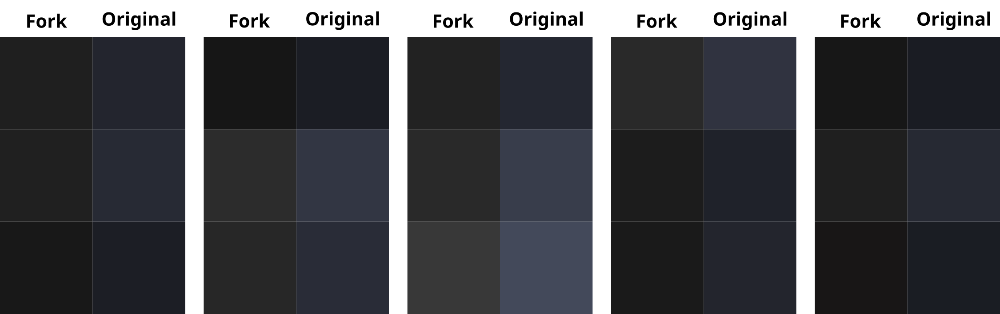

Skeuos-GTK-Darkest
===

Skeuos-GTK-Darkest is a fork of the [Skeuos-GTK](https://github.com/daniruiz/skeuos-gtk) theme, created by [daniruiz](https://github.com/daniruiz/). While the original theme features a blueish dark color scheme, Skeuos-GTK-Darkest modifies it to provide greyish/blackish dark theme.



Color scheme range (with a few exceptions): https://coolors.co/gradient-palette/161616-353535?number=30

## Structure

> Note: Currently, only the blue dark theme is in edit.

Currently Skeuos-GTK-Darkest is not part of the `/theme/` folder, but in `/themes_darkest`.

## Installation

> Note: Currently the theme is not yet installable through `generate-color-theme.sh`.

1. Clone the Skeuos-GTK-Darkest repository to your local machine

```
https://github.com/mxcom/skeuos-gtk-darkest/
```

2. Change into the theme directory

```
cd skeuos-gtk-darkest/themes_darkest
```

3. Copy the theme files to the appropriate directory

- For a system-wide installation:

```
sudo cp -r Skeuos-Blue-Darkest /usr/share/themes/
```

- For a user-specific installation (`~/.themes` may need to be created first):

```
sudo cp -r Skeuos-Blue-Darkest ~/.themes/
```

## Contributing

Contributions to Skeuos-GTK-Darkest are welcome. If you find any issues or have suggestions for improvements, please feel free to open an issue or submit a pull request on the GitHub repository.

## Credits

Skeuos-GTK-Darkest is based on the original Skeuos-GTK theme created by [daniruiz](https://github.com/daniruiz/). Thank you to the original author for their fantastic work!

## License

Skeuos-GTK-Darkest is licensed under the [GNU General Public License v3.0](https://www.gnu.org/licenses/gpl-3.0.en.html). Please review the license file for more information.
